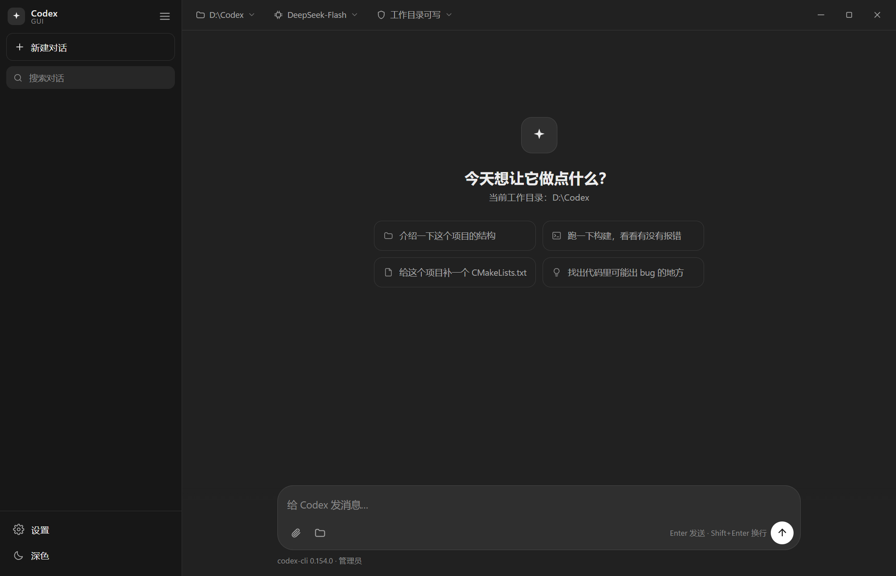

# Codex GUI

给 [Codex CLI](https://github.com/openai/codex) 套一层 Windows 原生界面：把命令行里的 Agent 变成一个有会话列表、Markdown 渲染、工具调用卡片、思考过程、图片附件的桌面窗口。


[English](README.en.md) | 简体中文

> 本项目是非官方第三方界面，与 OpenAI、DeepSeek 均无隶属关系。它只是调用你本机已安装的 Codex CLI，API 请求由 CLI 直接发往你自己配置的服务商。

## 特性

- **多会话**：左侧会话列表、搜索、新建、删除；每个会话各自绑定一个工作目录，可以同时跑多个会话（同一会话同一时刻只跑一轮）。
- **实时流式输出**：读取 `codex exec --json` 的事件流，边跑边渲染，不需要等整轮结束。
- **工具调用卡片**：命令、退出码、标准输出/错误，长输出自动折叠，一键复制。
- **文件改动 / 任务清单 / 思考过程**：以独立卡片展示，思考过程可以随时关掉。
- **Markdown 与代码高亮**：自带轻量渲染器（`wwwroot/md.js`），不依赖 CDN，离线可用。
- **图片附件**：粘贴或选择图片，随提示词一起交给 Codex（`-i` 参数）。
- **模型 / 推理强度 / 沙箱权限**：顶栏一键切换，只读、工作目录可写、完全访问三档。
- **界面设置**：深色 / 浅色 / 跟随系统、字号、Enter 发送、自动折叠、显示思考过程。
- **API 配置面板**：设置里直接填 API 链接、模型名和密钥，写进 codex-home，不用手改配置文件；首次启动会自动打开。
- **原生窗口体验**：无边框窗口 + WebView2 原生拖拽标题栏、双击最大化、右键系统菜单。
- **纯本地**：无账号、无遥测，所有会话与配置只保存在本机数据目录里。

## 界面截图



## 系统要求

| 组件 | 说明 |
| --- | --- |
| 系统 | Windows 10 1809 及以上 / Windows 11（x64） |
| 运行时 | [.NET 7 Desktop Runtime](https://dotnet.microsoft.com/download/dotnet/7.0)（自包含发布版不需要） |
| WebView2 | [Microsoft Edge WebView2 Runtime](https://developer.microsoft.com/microsoft-edge/webview2/)（Win11 自带，Win10 部分机器需要装） |
| Codex CLI | `@openai/codex`（需要 Node.js 18+），或任意一份 `codex.exe` |

## 快速开始

### 1. 安装 Codex CLI

```powershell
npm install -g @openai/codex
codex --version
```

装好后 GUI 会自动从 `PATH`、`%APPDATA%\npm`、`%LOCALAPPDATA%\npm` 里找到它；也可以把 `codex.exe` 放在程序目录的 `codex\bin\codex.exe`（便携包布局），或在设置里手动指定路径。

### 2. 配置 API

GUI 本身不保存 API 配置，它读的是 Codex CLI 的 `config.toml` / `auth.json`。数据目录默认是 `%LOCALAPPDATA%\CodexGui`，所以配置文件位于：

```
%LOCALAPPDATA%\CodexGui\codex-home\config.toml
%LOCALAPPDATA%\CodexGui\codex-home\auth.json
```

**方式 A（推荐，密钥不进配置文件）**：用环境变量提供密钥。

```toml
model = "deepseek-chat"
model_provider = "deepseek"
preferred_auth_method = "apikey"
forced_login_method = "api"

[model_providers.deepseek]
name = "deepseek"
base_url = "https://api.deepseek.com/"
wire_api = "responses"          # 新版 Codex CLI 只支持 Responses 协议
env_key = "DEEPSEEK_API_KEY"
```

```powershell
setx DEEPSEEK_API_KEY "你的密钥"   # 重新打开终端后生效
```

**方式 B（图形界面 / 新手）**：密钥写在本机文件里（仅本机可读）。

```jsonc
// %LOCALAPPDATA%\CodexGui\codex-home\auth.json
{ "auth_mode": "apikey", "OPENAI_API_KEY": "sk-你的密钥" }
```

完整的示例文件见 [`samples/`](samples/) 目录：

- [`samples/codex-config.deepseek.toml`](samples/codex-config.deepseek.toml)
- [`samples/codex-config.openai.toml`](samples/codex-config.openai.toml)
- [`samples/app-config.json`](samples/app-config.json)

也可以直接跑脚本交互式写入（不会在屏幕上回显密钥）：

```powershell
powershell -ExecutionPolicy Bypass -File scripts/setup-provider.ps1 -BaseUrl "https://api.deepseek.com/" -Model "deepseek-chat"
```

### 3. 运行

**从源码运行：**

```powershell
git clone https://github.com/Feanaze/CodexGui.git
cd CodexGui
dotnet run
```

**从 Release 运行：** 解压后双击 `CodexGui.exe`。

## 安装包（一键安装，可选）

`installer/` 可以把整个程序打成一个 **exe 安装包**：自带 .NET 运行时和 Codex CLI，目标机器不需要预先装任何环境。

```powershell
.\installer\build-installer.ps1 -OutputExe D:\CodexGui-Setup-1.0.0.exe
```

安装包会做这些事：

| 步骤 | 说明 |
| --- | --- |
| 释放文件 | `<安装目录>\app`（程序 + 自包含运行时）、`<安装目录>\codex`（CLI） |
| 数据目录 | 写 `<安装目录>\app\portable.marker`，让数据落在 `<安装目录>\data` |
| 默认工作目录 | 写 `<安装目录>\data\config.json`，`WorkDir` = 安装目录 |
| PATH | 把 `<安装目录>\codex\bin` 加进用户 PATH（界面里可取消） |
| 快捷方式 | 桌面 + 开始菜单（可取消） |
| 卸载 | 注册到「应用和功能」，卸载程序是 `<安装目录>\uninstall.exe` |

安装包内**不包含任何密钥、对话记录或用户配置**，只有程序文件、运行时和 CLI 二进制；`data` 目录是安装之后运行时才生成的。

静默安装 / 自定义目录：

```powershell
CodexGui-Setup-1.0.0.exe /silent /dir=D:\CodexGui
CodexGui-Setup-1.0.0.exe /nopath /noshortcut /nolaunch
```

装完第一次启动会自动打开设置面板：填上 API 链接（例如 `https://api.deepseek.com/`）、模型名和密钥就能开始对话，内容写到 `<安装目录>\data\codex-home\config.toml`，只保存在本机。构建细节见 [installer/README.md](installer/README.md)。

## 命令行参数

```powershell
CodexGui.exe                                  # 正常启动
CodexGui.exe --selftest "只回复：pong" [目录]  # 不开界面，跑一轮确认 codex 链路通
CodexGui.exe --autorun "你好"                  # 启动后自动发一条消息（自动化测试用）
```

## 配置

应用自己的配置写在 `<数据目录>\config.json`，字段说明见 [docs/CONFIGURATION.md](docs/CONFIGURATION.md)，常用的几项：

| 字段 | 默认值 | 说明 |
| --- | --- | --- |
| `WorkDir` | 用户主目录 | 默认工作目录，也决定 Codex 的沙箱根目录 |
| `CodexPath` | `null` | 手动指定的 `codex.exe`；留空自动检测 |
| `Model` | `""` | 传给 `codex -m` 的模型名；留空用 CLI 默认值 |
| `ReasoningEffort` | `""` | `low` / `medium` / `high` / `max` |
| `Sandbox` | `workspace-write` | `read-only` / `workspace-write` / `danger-full-access` |
| `Theme` | `dark` | `dark` / `light` / `system` |
| `FontSize` | `15` | 聊天区字号（11–24） |
| `ShowReasoning` | `true` | 是否显示思考过程 |
| `AutoCollapseTools` | `true` | 长命令输出默认折叠 |
| `SendOnEnter` | `true` | 关闭后 `Ctrl+Enter` 才发送 |

## 数据、隐私与安全

- **不联网上报**：应用没有任何遥测、统计或自动更新请求；网络流量只来自你配置的 API 服务商。
- **数据只在本地**：会话记录 `<数据目录>\sessions\*.json`、配置 `config.json`、日志 `log.txt`、Codex 的 `codex-home`（含 `auth.json`）都在本机数据目录里。
- **数据目录位置**（按优先级）：
  1. 环境变量 `CODEXGUI_DATA_DIR`
  2. 程序目录下存在 `portable.marker` → `<程序目录>\data`（便携模式）
  3. 已存在配置的 `%LOCALAPPDATA%\CodexGui`
  4. `D:\Codex\CodexGuiData`（早期开发版本路径，存在则继续沿用）
  5. 默认 `%LOCALAPPDATA%\CodexGui`
- **密钥不要提交到仓库**：`.gitignore` 已经屏蔽了数据目录、`auth.json`、`config.toml`、`*.sqlite`、`sessions/`。开源前请再跑一遍 [`scripts/check-secrets.ps1`](scripts/check-secrets.ps1)。
- **沙箱**：默认 `workspace-write`，Codex 只能改工作目录内的文件；`danger-full-access` 会跳过限制，请谨慎使用。

## 项目结构

```
CodexGui/
├─ App.xaml / App.xaml.cs        程序入口、单实例、命令行参数
├─ MainWindow.xaml(.cs)          WPF 外壳：WebView2 宿主、消息桥、会话与进程调度
├─ Services/
│  ├─ AppConfig.cs               应用配置（config.json）读写与合并
│  ├─ StoragePaths.cs            数据目录解析（便携/LocalAppData/环境变量）
│  ├─ CodexLocator.cs            查找 codex.exe（便携目录 → PATH → npm 目录）
│  ├─ CodexRunner.cs             启动 codex 子进程、解析 JSONL 事件流
│  ├─ CodexEnvironment.cs        给子进程补 HOME / CODEX_HOME
│  ├─ SessionStore.cs            会话（sessions/*.json）读写
│  ├─ WebAssets.cs               把 wwwroot 作为内嵌资源提供给 WebView2
│  └─ Log.cs / SelfTest.cs       日志与命令行自检
├─ wwwroot/                      前端界面（原生 HTML/CSS/JS，构建后嵌入 exe）
│  ├─ index.html                 布局与图标
│  ├─ app.js                     状态机、渲染、消息桥
│  ├─ styles.css                 主题与样式
│  └─ md.js                      Markdown / 代码高亮
├─ tools/                        Node 脚本：DOM 桩、并发/UI 冒烟测试、图标生成
├─ installer/                    单文件安装包：Win32 安装/卸载程序 + 打包脚本
├─ docs/                         架构、构建、配置、FAQ
└─ samples/                      配置示例（不含任何密钥）
```

## 从源码构建

```powershell
dotnet build CodexGui.csproj -c Release
dotnet run
```

发布成单文件（目标机器需要装 .NET 7 Desktop Runtime）：

```powershell
dotnet publish CodexGui.csproj -c Release -r win-x64 `
  -p:PublishSingleFile=true -p:SelfContained=false -o dist
```

想做完全自包含（目标机器什么都不用装）就加 `-p:SelfContained=true`；想做便携包（数据跟着程序走）就在输出目录放一个空的 `portable.marker` 文件。详细步骤见 [docs/BUILD.md](docs/BUILD.md)。

## 常见问题

遇到「找不到 codex 命令」「界面一片空白」「中文乱码」「会话不见了」等问题，先看 [docs/FAQ.md](docs/FAQ.md)。

## 参与贡献

欢迎 PR 和 Issue，提交前请阅读 [CONTRIBUTING.md](CONTRIBUTING.md) 与 [CODE_OF_CONDUCT.md](CODE_OF_CONDUCT.md)。安全问题请按 [SECURITY.md](SECURITY.md) 私下反馈，不要开公开 Issue。

## 免责声明

- 本项目是第三方开源工具，与 OpenAI、DeepSeek 无隶属或背书关系。
- Codex CLI 由 OpenAI 单独发布，本项目不随仓库分发其二进制；请按其许可与使用条款自行安装。
- 使用本工具产生的 API 费用、以及对文件和系统做出的改动，由使用者自行承担。

## 许可证

[MIT](LICENSE) © 2026 Feanaze

第三方组件的许可说明见 [THIRD-PARTY-NOTICES.md](THIRD-PARTY-NOTICES.md)。
